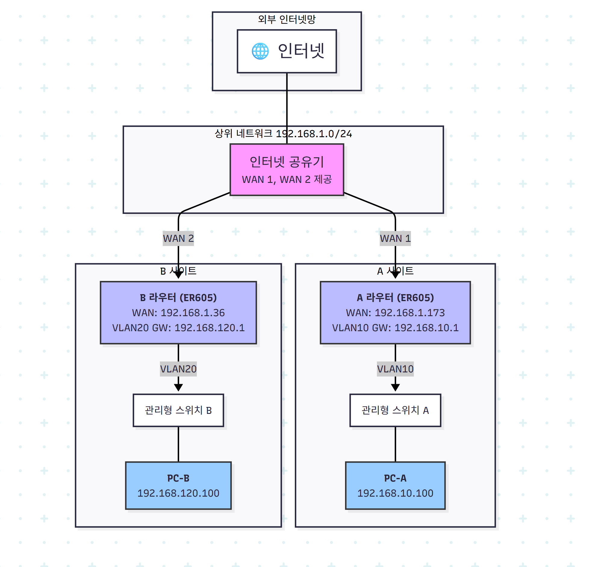
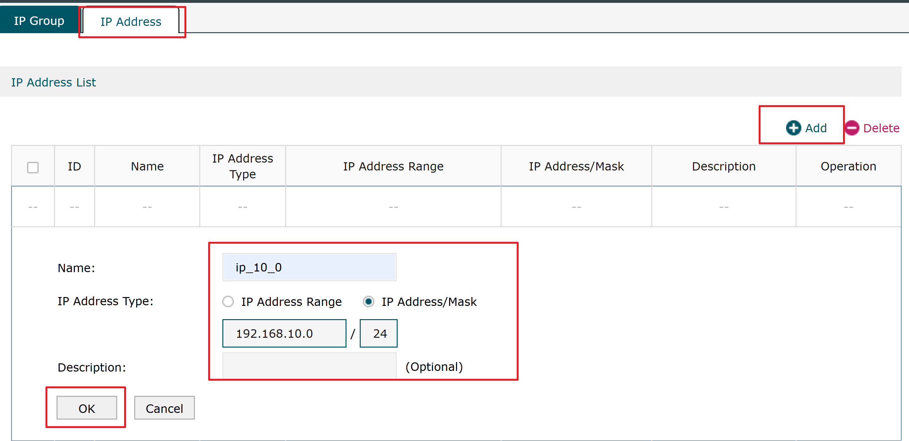

### **전체 시스템 구성도**

먼저 현재 네트워크 구성을 그림으로 표현하면 다음과 같습니다.

### **문제점**

*   **A 라우터**는 B 사이트의 내부 네트워크(`192.168.120.0/24`)로 가는 길을 모릅니다.
*   **B 라우터**는 A 사이트의 내부 네트워크(`192.168.10.0/24`)로 가는 길을 모릅니다.

### **해결책: 정적 라우팅(Static Routing) 및 방화벽 설정**

각 라우터에 상대방 네트워크로 가는 경로를 수동으로 알려주고, 보안 정책(방화벽)에서 해당 통신을 허용해야 합니다.

---

### **설정 방법**

#### **1. A 라우터 설정 (WAN: 192.168.1.173)**

PC-A에서 PC-B로 가는 길을 알려주고, PC-B로부터 오는 응답을 허용합니다.

*   **정적 라우팅 (Static Route) 추가**
    *   **목표**: A 라우터에게 "목적지가 `192.168.120.x` 네트워크이면, 
                  B 라우터(`192.168.1.36`)에게 전달해라" 라고 알려줍니다.
    *   **경로**: `Transmission(전송)` > `Routing` > `Static Route`
    *   **설정 내용**:
        *   **Destination IP**: `192.168.120.0`
        *   **Subnet Mask**: `255.255.255.0`
        *   **Next Hop**: `192.168.1.36`
        *   **Interface**: `WAN1` (192.168.1.173이 연결된 WAN 포트)

*   **방화벽 (Firewall/ACL) 추가**

    *   **목표**: B 사이트에서 오는 트래픽을 허용합니다. (ER605의 기본 정책에 따라 필요할 수 있습니다)
    *   **경로**: `Firewall` > `Access Control`
    *   **설정 내용**:
        *   **Policy**: `Allow`
        *   **Source IP**: `192.168.120.0/24`
        *   **Destination IP**: `192.168.10.0/24`
        *   **Protocol**: `ALL`

#### **2. B 라우터 설정 (WAN: 192.168.1.36)**

PC-B에서 PC-A로 가는 길(응답 경로)을 알려주고, PC-A로부터 오는 요청을 허용합니다.

*   **정적 라우팅 (Static Route) 추가**
    *   **목표**: B 라우터에게 "목적지가 `192.168.10.x` 네트워크이면, A 라우터(`192.168.1.173`)에게 전달해라" 라고 알려줍니다.
    *   **경로**: `Transmission(전송)` > `Routing` > `Static Route`
    *   **설정 내용**:
        *   **Destination IP**: `192.168.10.0`
        *   **Subnet Mask**: `255.255.255.0`
        *   **Next Hop**: `192.168.1.173`
        *   **Interface**: `WAN1` (192.168.1.36이 연결된 WAN 포트)

*   **방화벽 (Firewall/ACL) 추가**
    *   **목표**: A 사이트에서 오는 트래픽을 허용합니다. **이전 테스트에서 이 부분이 문제였을 가능성이 높습니다.**
    *   **경로**: `Firewall` > `Access Control`
    *   **설정 내용**:
        *   **Policy**: `Allow`
        *   **Source IP**: `192.168.10.0/24`
        *   **Destination IP**: `192.168.120.0/24`
        *   **Protocol**: `ALL`

---

### **※ 매우 중요한 추가 확인 사항**

위 라우터 설정을 모두 정확하게 완료했음에도 통신이 안 된다면, 문제는 라우터가 아닌 다른 곳에 있습니다.

1.  **PC-B (192.168.120.100) 자체 방화벽 확인**
    *   가장 가능성이 높은 원인입니다. PC-B의 Windows 방화벽이나 백신 프로그램이 다른 네트워크 대역(`192.168.10.x`)에서 오는 Ping(ICMP) 요청을 차단하고 있을 수 있습니다.
    *   **테스트**: PC-B의 방화벽을 잠시 비활성화하고 PC-A에서 `ping 192.168.120.100`을 실행해보세요.

2.  **관리형 스위치 포트 설정 확인**
    *   **라우터와 스위치를 연결하는 포트**: VLAN 태그가 지나다녀야 하므로 **Trunk(태그된)** 포트로 설정되어야 합니다.
    *   **스위치와 PC를 연결하는 포트**: 특정 VLAN에 소속되어야 하므로 **Access(태그되지 않은)** 포트로 설정하고, 해당 VLAN ID(PVID)를 지정해야 합니다. (예: 스위치 A의 PC연결 포트는 VLAN10 Access, 스위치 B의 PC연결 포트는 VLAN20 Access)

이전의 상세한 문제 해결 과정을 통해 라우터 간 설정은 문제가 없었고, 최종적으로 PC 자체 방화벽이나 스위치 설정이 문제일 것으로 추정되었습니다. 위 라우터 설정을 다시 한번 확인하신 후, **'중요한 추가 확인 사항'**에 있는 두 가지를 반드시 점검해 보시기 바랍니다.